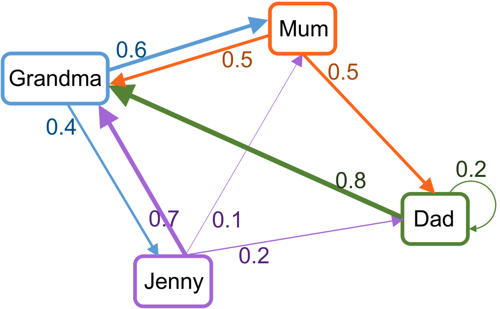

Hidden Markov model is proposed based on a simple notion: we are only able to observe a small portion of the world and the underlying mechanisms generating such observables are hidden. For example, we can observe the weather of each day without being aware of the complicated atmospheric dynamics that govern it.

Although not able to fully understand the latent mechanisms, we still want to infer general principles from accumulated observations and predict future observations. For this purpose, the Hidden Markov model (HMM) was proposed.

Hidden Markov model consists of two parts:
The hidden part where the state of the system evolves dynamically following certain rules;
and the observable part where we can observe the emitted signals depending on the state of the hidden system.

The transition of the states of the hidden system is described as a Markov chain, where the state in the current time step follows a distribution that is solely determined by the state in the previous time step. This property that the current state depends on no more than the state one step before is called the Markov property.

In short, hidden Markov model incorporates a Markov chain modeling the hidden system, and a rule on how the hidden state produces observables.

Let's use a simple example to bring these abstract concepts to life.

Suppose there is a family bakery in your neighborhood. Each day you pass by the bakery and the bakery bakes delicious special cookies on some of the days. Since you absolutely don't want to miss these cookies, you take notes every day about whether the cookies are baked.

Therefore, you have from day 1 to day $\tau$ a series of numbers:
$$0, 1, 0, 0, 1, 1, ..., 0$$
where $0$ means the corresponding day there was no cookie and $1$ means that there were cookies baked.

Let's denote the value in this series on day $t$ as $X_t$. Hence, $X_t$ is our **observation** on day $t$.

But what determines whether cookies are baked? This is hidden behind the counter from a cookie-loving customer. Apparently, the family in the bakery takes turns to be the chief baker on each day.

The family members include Jenny, her Grandma, her Mum and her Dad. Whoever was the chief baker the day before decides who takes the chief position the current day.

The rule of transition is determined by the following graph:

::: {.cell}
{width=60% fig-align="center"}
:::

The nodes in the graph represent each family member. The weights on the edges represent the possibility of transition from one person to another.
For example, if Grandma was the chief baker on day $t-1$, then on day $t$, there will be 0.6 chance that Mum is the chief baker and 0.4 chance Jenny will be the chief baker.

With this rule, it is possible to have a sequence of the chief bakers from day 1 to day $\tau$ as follows:
$$Mum, Grandma, Jenny, Dad, Dad, Grandma, ..., Jenny$$
Let's denote the chief baker on day $t$ as $S_t$. We can call $S_t$ the **hidden state** of the bakery on day $t$.

Now we modeled how the hidden state transitions as a Markov chain. The last thing we need is to model how the hidden state $S_t$ decides on the observable $X_t$, i.e. how the chief baker decides whether to bake the cookies.

When Grandma is the chief baker, she is more likely to bake cookies. On the other hand, when Mum is the chief baker, she prefers to not bake cookies. We can summarize the probability for having cookies, when each of the family member is on duty in the following graph:

::: {.cell}
{width=60% fig-align="center"}
:::

The **emitting probability** of observing $X_t$ given the hidden state $S_t$ is thus denoted as
$$P(X_t|S_t),$$
which is called the conditional probability of $X_t$ given $S_t$.

Reading from the graph, the probability of baking cookies, given that on day $t$ Grandma is the chief baker, is
$$P(X_t = 1| S_t = Grandma) = 0.9$$.

Now we learned how to build a hidden Markov model: model the hidden part as a Markov chain, and model the emission of observables from the hidden states as conditional probabilities. The next task is to infer the sequence of hidden states for the sequence of observations. More advanced task would be to learn the transition rules based on the observations.

For more advanced knowledge about the hidden Markov model, one could check out this [tutorial](https://engrxiv.org/preprint/view/765/).