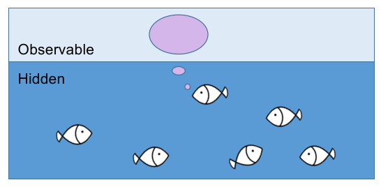

Hidden Markov models (HMMs) are widely used in modeling sequential data, for example xxx.

The core concept of the hidden Markov model is simple:
The evolution of a system is not directly observable. The system evolves by its own rule and emitts signals that can be sensed by us.
Thus, the model of the system is divided into two parts:
The hidden part where the state of the system evolves dynamically following certain rules;
and the observable part where we can observe the emitted signals depending on the hidden state.

To give an intuition, imagine that under the warter surface, there is a group of fish playing a game. At each time step, the game allows one of the fish to produce some bubbles. The fish are hidden and only the bubbles can be observed.

Since the fish can only remember which fish was producing bubbles in the previous time step, not two or more steps before, the choice of the next fish only depend on the previous one. This rule is abstracted as the so called Markov property.

This blog post is inspired by the Sun paper after discussing about it in a journal club. 

Thoughts from neuroscience perspective