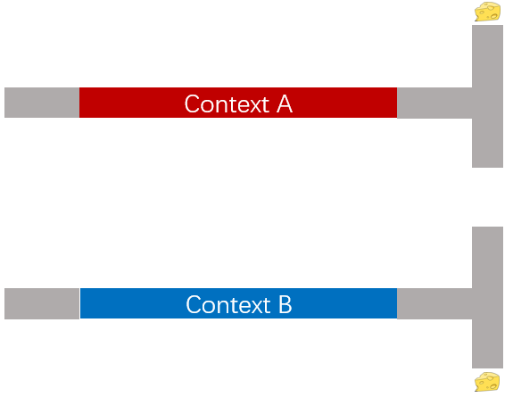
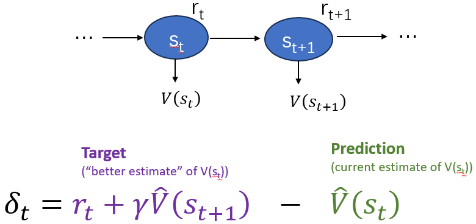
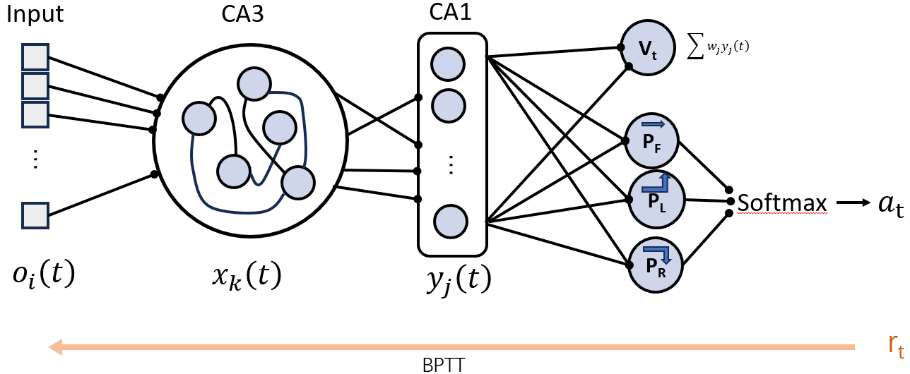
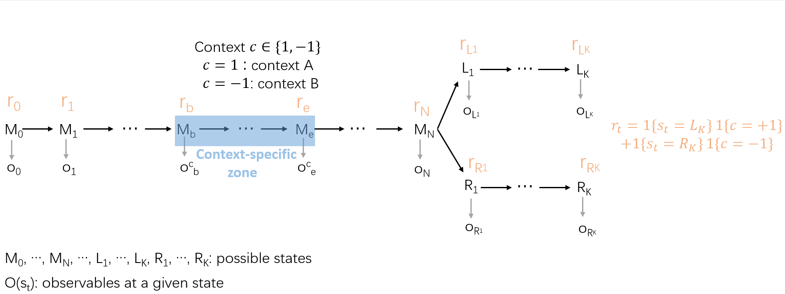
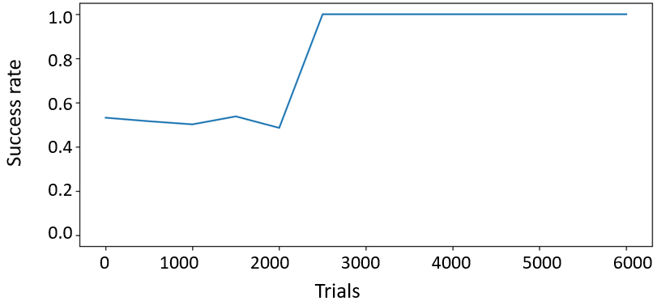
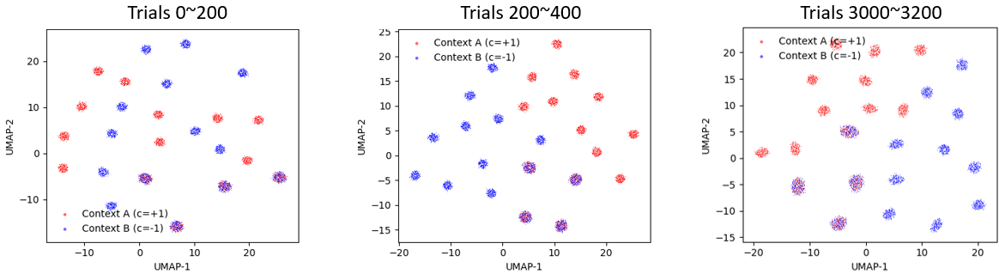
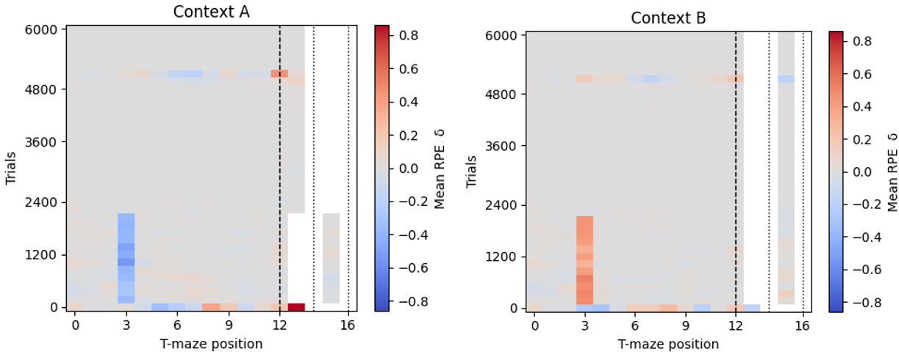

Since I joined CEBSIT in Shanghai, I have been participating in a weekly workshop on computational neuroscience. The workshop has a nice structure of first introducing basic computational neuroscience concepts and then encouraging students and postdocs to try out those concepts on their own experimental data.

This blog is one of such attempts: I was analyzing recordings of neuronal activities as animals learn to navigate in a T-shaped maze in a context-dependent manner (Fig. 1). Context generally refers to a diffusive set of sensory stimuli that spans a certain range of space and time, but here the context is narrowly defined to be a combination of visual stimuli that stretches along the middle range of the main track of the T-maze. In each trial, either context A or B was given and the animal learns to associate context A with turning left at the end of the main track, and B with turning right, in order to receive a reward.

::: {.cell}
{width=50% fig-align="center"}
:::

As I am almost clueless about how to analyze such a dataset, I decided to try an angle learned from the workshop: the reward prediction error.

Briefly, the reward prediction error is a measure used in reinforcement learning that quantifies how much error an agent makes in predicting future reward. In the context of neuroscience, let's call the agent an "animal". At each time step $t$, the animal resides in a state $s_t$. Depending on the state, the animal receives a reward with its value given by $r_t$. Hence, each possible state is associated with a so-called value $V(s_t)$, which is defined as:
$$V(s_t) = \mathbb{E}[\sum_{i=0}^{\infty}\gamma^i r_{t+1}]$$, the expectation of all the future reward, weighted by a power of a discount factor $\gamma$, depending on how far in the future the reward will be.

However, the ground-truth value function $V(s_t)$ defined in the environment is not directly accessible; it can only be estimated by the animal. To improve the estimation $\hat{V}(s_t)$ step by step, the animal can compare the current estimate $\hat{V}(s_t)$ and the estimate based on the current reward information $r_t + \gamma \hat{V}(s_t)$, which can be thought of as a "better" estimation. The reward prediction error is thus the difference between the "prediction" $\hat{V}(s_t)$ and the "target" $r_t + \gamma \hat{V}(s_t)$:

::: {.cell}
{width=80% fig-align="center"}
:::

Before using this framework to model the task learning, another important factor needs to be added: the animal does not only estimate the future reward passively, but also takes actions to increase the chance of getting a reward. For simplicity, the state $s_t$ of the animal is the location of the animal in the T-maze, and the action $a_t$ is sampled from $\{"forward", "left turn", and "right turn"\}$. Obviously, the choice of action $a$ depends on the state $s$, and this dependency is modeled as a conditional probability distribution $\pi(a|s)$.

Now our model has two parts: the action selection and the value estimation. This kind of model is called an actor-critic model in reinforcement learning, where the actor chooses actions and the critic evaluates them to guide learning and improve performance over time.

Boiling down to the model architecture, we need some output units to encode the action policy, which is the probability of taking each of the possible actions ($P_{forward}, P_{left}, P_{right}$). In addition, we need an output unit to encode the estimation of $V_t$. The input signal is a high-dimensional vector, varying across spatial location and is context-specific. The latent layers include a recurrent neural network (CA3) feedforwardly connected to a single layer (CA1), which is an over-simplification of the hippocampus (Fig. 3).

::: {.cell}
{width=80% fig-align="center"}
:::

To model the T-maze where the animal navigates, we defined the states as discrete positions along the main track and the goal arms (Fig. 4). At each position, the animal observes a high-dimensional input signal. Within the middle range of the main track, the observables have a context-dependent remapping. Depending on the context, either the end of the left arm or right arm has a reward value of 1; at other positions, the reward is simply 0.

::: {.cell}
{width=80% fig-align="center"}
:::

Now we are ready to train the network with the backpropagation through time (BPTT) algorithm combined with actor–critic loss functions, including generalized advantage estimation (GAE) to stabilize learning. We see that after approximately 2000 trials, the modeled animal reached a 100% success rate in choosing the turning direction.

::: {.cell}
{width=80% fig-align="center"}
:::

Interestingly, context-specific representations emerged in the modeled CA1 layer. Initially, CA1 activity patterns for Context A and Context B were mixed, and with learning, these representations gradually separated, even before the modeled animal correctly performed the task at the behavioral level.

::: {.cell}
{width=80% fig-align="center"}
:::

Another hallmark of learning appeared in the RPE signal: early in training, RPE was strongest at reward delivery. As learning progressed, RPE shifted backward in time, peaking near the beginning of the context region. After the task had been fully learned, the RPE signal almost disappeared. This temporal shift is a classic prediction of reinforcement learning theory.

::: {.cell}
{width=80% fig-align="center"}
:::

In summary, this is an interesting exploration and helps me to model in my brain the mechanism of reward-driven learning. It might also inspire the analysis of the dataset of the CA1 recordings and the design of new experiments. Faced with a combinatorially large number of possible research directions at the early phase of a project, I find having a starting point like this is helpful to dampen the anxiety as a new postdoc.
